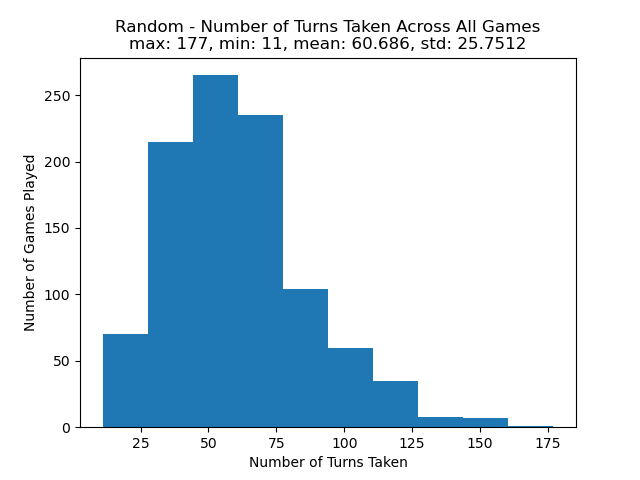
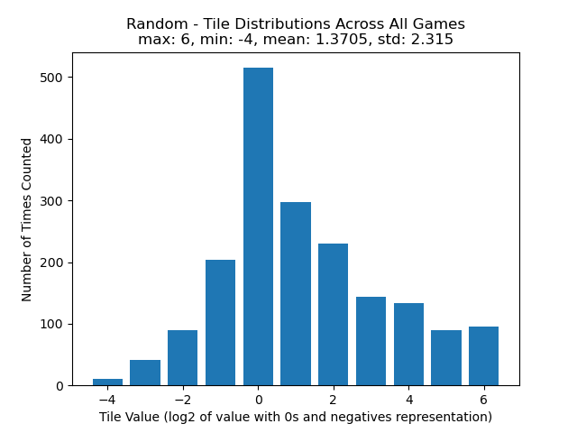
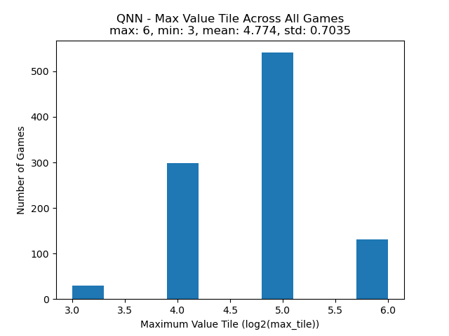
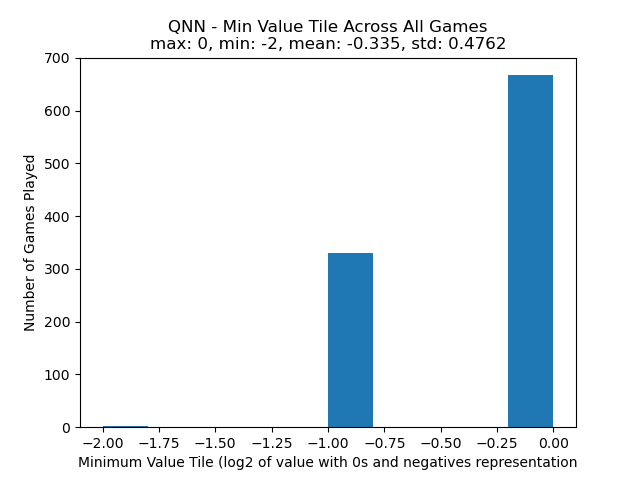
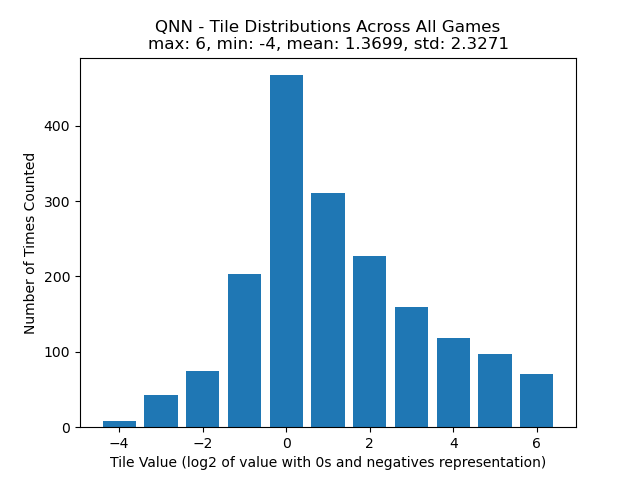

# Final Project - Solving 2048 with Monte Carlo Tree Search
**COMP 3106 A F23**

- Carlo Flores - 101156348
- Michael Macdougall - 101197828

## Statement of contributions
- Both Carlo and Michael made significant contributions
- Both Carlo and Michael made approximately equal contributions
- Carlo made contributions to  the implementation of the game 2048 as well as the implementation of Monte Carlo trees 

## Introduction
### Motivation behind implementation

### Objectives 

## Methods

### Q-Learning

In the proposal we had the intention of using Q-learning to map the state action pairs of 2048 to their respective Q-values and repeating this process until they converge. However we quickly realized that this would be next to impossible for a complex game like 2048. The game 2048 has a large action space which means that it has four possible moves (up,down,left and right) for each game state. Q-Learning is able to handle problems with a discrete number of actions like this but when applied to larger problems like 2048 it is unable to process that many different states.

### Deep Q-Learning (DQN)

### Monte Carlo Tree Search (MCTS)

## Running the Project Locally
This project can be run by cloning or downloading the repository on GitHub (https://github.com/tfwe/3106-project/) and running the following shell commands in the root directory of the downloaded repository. 

  >`pip3 install -r requiremnets.txt`
  
  >`python3 test.py [NUM_RUNS]`

If specified, `NUM_RUNS` will allow `test.py` to sample `NUM_RUNS` games from each policy. For example, we can run to extract data from 1000 games on each policy. 

  >`python3 test.py 1000`

### Multithreading Crashes
Occasionally, only when running from `test.py`, the multithreading module used in `mcts.py` may complain about being not running in main loop. This can be mitigated by simply running shell command in the repository's root directory to test the MCTS implementation instead. 

  >`python3 mcts.py` 

The data extracted will be saved the the `./Results` folder, which will include a visual representation of each distribution, as well as the CSV files containing the raw data collected from each game used to generate the visuals.

## Results
We tested 3 different policies on 2048 to interpret and evaluate performance. To validate our results, we sampled 1000 games under a random move policy, and extracted the distribution of maximum value tiles, the number of turns, and the distribution of different values pieces as each game progressed. We used each of these inferences as our ground truths, and used them to compare the results we obtained from our DQN and MCTS policies. For visual simplicity, we are using the base 2 logarithm of each piece's respective value to represent it. 

### Random Sample Games:

### DQN Sample Games:

### MCTS Sample Games:

## Discussion

## References
- Chan, L. H. (2022, June 9). Playing 2048 with Deep Q-Learning (With Pytorch implementation). Medium. https://medium.com/@qwert12500/playing-2048-with-deep-q-learning-with-pytorch-implementation-4313291efe61

- Silver, D., Hubert, T., Schrittwieser, J., Antonoglou, I., Lai, M., Guez, A., Lanctot, M., Sifre, L., Kumaran, D., Graepel, T., Lillicrap, T., Simonyan, K., & Hassabis, D. (2017). Mastering chess and shogi by self-play with a general reinforcement learning algorithm. https://doi.org/10.48550/ARXIV.1712.01815
