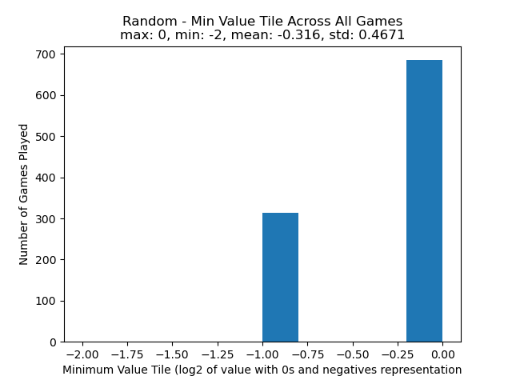
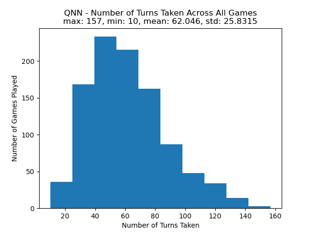
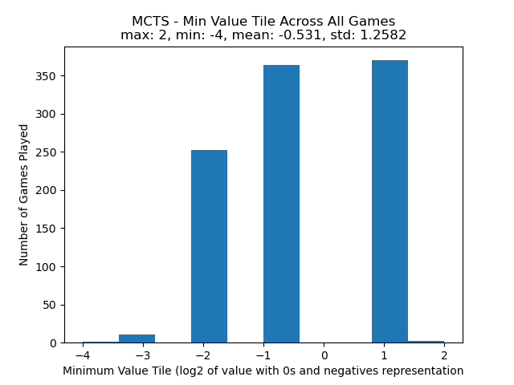
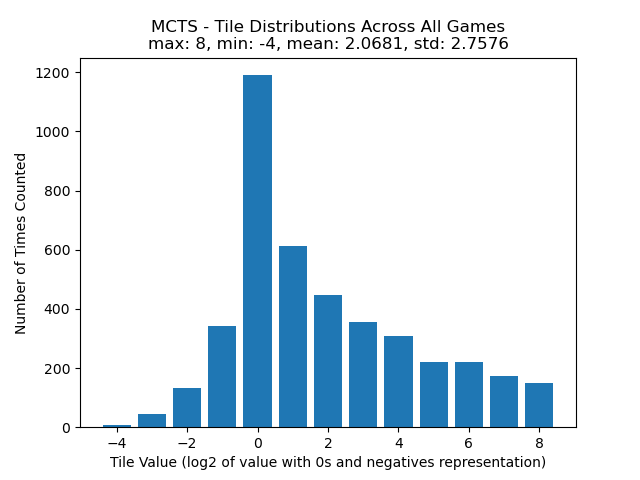

# Final Project - Solving 2048 with Monte Carlo Tree Search
**COMP3106 A F23**
## Statement of Contributions
- Both Carlo and Michael made significant contributions
- Both Carlo and Michael made approximately equal contributions
- Carlo made contributions to the implementation of the game 2048 as well as the implementation of Monte Carlo trees, DQN and the Project Report. Michael made contributions to the implementation of DQN as well as the Project Report.

## Introduction
### Background and Motivation for the Project
The motivation behind this idea was that Carlo and I wanted to find a fun and interesting way that we could apply the methods used earlier in the course to solve a game. We had initially thought of ideas like creating an AI for Chess or Tetris but those ideas were a bit too far out of our knowledge. We looked for something that was a challenge yet still felt possible for our given knowledge on the subject. Given these parameters, we decided to make a version of 2048 with a 3x3 grid instead of 4x4 this greatly reduces the time it takes to run our agent we also added negative tiles that cancel out with positive ones this was to help make a 3x3 board possible, the negative tiles help to free up other spaces. The only issue we had left was the scoring, in regular 2048 the score is based on the tiles that are merged together. For example combining a 32 with another 32 results in the score increasing by 64. This would be obstructed by the new negative tiles that were added so instead subtracting from the score when combining negative tiles with positive ones, we determined that the best gage of score in this new version would be how many turns the agent is able to play for. 

### Objectives 
- Make a version of 2048 that is 3x3
- Add Negative tiles to the game
- Find a new scoring system that fits this altered version of 2048
- Have our AI agent be better than making random moves
- Have our AI agent get to a tile of 256
- Implementing the game playing agent using Q-learning
- implementing the game playing agent Deep Q-learning
- Implementing the game playing agent using Monte Carlo Tree Search

### Related Prior Work
Carlo and I both have experience with neural networks from COMP3105 (Intro to Machine Learning), where we had to make a Convolutional Neural Network to identify images of numbers. We also have a good understanding of how Q-learning may be applied to our game especially after completing assignment 3.

## Methods
### Q-Learning using a Q-Table
In the proposal we had the intention of using Q-learning to manually map the state action pairs of 2048 to their respective Q-values and repeating this process until they converge. However we quickly realized that this would be next to impossible for a complex game like 2048. The game 2048 has a considerably large state space, even when reduced to a 3x3 grid instead of a traditional 4x4 grid. This means that for every legal move on a given state, there are many possible resulting states given that action. Q-Learning using a Q-Table is able to handle problems with a discrete number of actions like this when applied to an environment with smaller state space, or when the environment is deterministic, but when applied to larger problems like 2048, bruteforce is simply not an option worth considering.

### Deep Q-Learning (DQN)
Instead of abandoning the Q-learning method there was an alternative that can still utilizes this idea of mapping a state action pair to a value and that was deep Q-learning. This can be performed by using a neural network instead of a Q-table. We can do this by feeding the neural network inputs (an encoded board state) that is processed by the neural network to output 4 Q-values, each representing a legal move in 2048. Using this method allows us to learn complex features when approximating the Q-function, without having to manually calculate a Q-value for every possible state-action pair. In Q-learning, a replay buffer stores past experiences and allows the agent to learn from said random past experiences; this makes it so that the agent doesn’t find a correlation in the data and gets stuck in one path that it believes to be the best. These past experiences are taken in batches of a set size to run in parallel in order to make the training process more efficient. Due to lack of knowledge or experience with DQNs we were unable to find out what was making this method so inefficient, maybe it was improper use of the replay buffer or incorrect implementation of batches, but the results of the DQN were very similar to the results of the random sample games.

### Monte Carlo Tree Search (MCTS)
The last method we implemented was Monte Carlo Tree Search. This is a model-less iterative search approach to approximating optimal moves in our environment. It works through the use of 4 main functions in the algorithm. The first function, `expansion` is called on the root node of the tree, which represents the board's current game state. From here, the algorithm creates a child node for a number of possible immediate subsequent states. The reason we do this is because we want to try and capture the average prospect of a node when evaluating it based on its children rather than a single run from that move since our environment is stochastic. 

From each new node in the tree, we then run the `simulation` function. This function plays a random move on a simulated board from the each of the leaves of the tree and evaluates its subsequent position based on an evaluation function that assigns a score to a position given the number of empty tiles and the sum of all tiles on the board. The function we used to calculate this is simply the sum of values on the board array multiplied by the number of empty tiles available. 

Each leaf node is then passed into the `update` function, which updates the scores of all parent nodes associated with the given child node. The score of a parent node after this function runs is the sum of all the scores of its children. The `update` function also updates the number of times each node has been updated. This is to allow us to balance exploration vs exploitation in our move selection process. This process of 

To finally select a move from our tree, we call the `selection` function on the leaf nodes of our tree. Here, we assign a `UCB1` (Upper Confidence Bound) score to each node, which balances the score that node received with the number of times it has been played. The `UCB1` score of a node is given by the following function.

>	`score(node)/node.times_played + math.sqrt((2 * math.log(total_plays)) / node.times_played)`

The move with the highest `UCB1` is selected as the best move for that iteration. The more iterations are run, the more accurate MCTS' prediction of the optimal move becomes. 

## Validation Strategies
In order to see that our implementation was effective we used retrospective validation where we took different statistics about each different method including the max tile, min tile, distribution of tiles and number of turns and we compared them against each other. These statistics can be found in the results section of the report.

  
## Running the Project Locally
This project can be run by cloning or downloading the repository on GitHub (https://github.com/tfwe/3106-project/) and running the following shell commands in the root directory of the downloaded repository. 

  >`pip3 install -r requiremnets.txt`

In order to run our implementation of MCTS, we can use `mcts.py`

  >`python3 mcts.py`

In order to run our implementation of Deep Q-Learning, we can use `qnn.py`

  >`python3 qnn.py`

To generate figures as seen in the results section below, we use `test.py`

  >`python3 test.py [NUM_RUNS]`

If specified, `NUM_RUNS` will allow `test.py` to sample `NUM_RUNS` games from each policy. For example, we can run to extract data from 1000 games on each policy. 

  >`python3 test.py 1000`

## Results
We tested 3 different policies on 2048 to interpret and evaluate performance. To validate our results, we sampled 1000 games under a random move policy, and extracted the distribution of maximum value tiles, the number of turns, and the distribution of different values pieces as each game progressed. We used each of these inferences as our ground truths, and used them to compare the results we obtained from our DQN and MCTS policies. For visual simplicity, we are using the base 2 logarithm of each piece's respective value to represent it. For negative and 0-valued tiles, we are representing them using `(-1) * log2(abs(tile_value))` and `0` respectively. This means that given the tile values `[-4, -2, 0, 2, 4, 8, 16, 32]`, we would represent them as `[-2, -1, 0, 1, 2, 3, 4, 5]`.

### Qualitative
Upon testing our implementations against each other, we found that while the Q-Learning neural network took longer to train, once it was trained, it evaluated positions just as fast as the random policy. In our case, the model we learned seemed unable to reasonably perform better than the random policy, but we believe that this is more of a limitation in our knowledge of deep Q-learning than it is a limitation of the method used. Monte Carlo Tree Search, in comparison, was much slower but performed significantly better on average in comparison to the random and deep Q-learning policies. Because of the iterative search nature of the algorithm, and the fact that we are not learning a model of the environment results in Monte Carlo Tree Search to be slower and exponentially more computationally expensive as the algorithm iterates through higher depths in the state space. There are a number of improvements that could be made to the implementation that would help to increase the speed of the algorithm, such as using a more efficient representation of the board state such as a bitboard representation. Regardless of these limitations, however, we were still able to reasonably simulate enough games to evaluate the performance.

### Quantitative
#### 1000 Random Sample Games:

Our random sample games show us that on average, each game lasts 61 turns when using a random move policy. The longest game played lasted for 177 turns, and the maximum-valued tile reached was 64.

#### 1000 DQN Sample Games:

Our DQN sample games show us a result that is akin to random play. We found that using our model also averaged 62 turns and the longest game lasted for 157 turns, which is similar to that of the random policy test. The maximum valued tile our model reached was also 64. Something else that is worth noting is that the standard deviation of each distribution is very close to that of the random policy. 

#### 1000 MCTS Sample Games:

Monte Carlo Tree Search by far outperformed our Deep Q-Learning neural network and the random move policy in both the maximum tile reached on average, as well as the number of turns played on average before the game ends. We found that the average MCTS game lasted for 153 turns, which is close to the maximum turn count for both the QNN and random policy games. The maximum valued tile reached was 256, which had never previously been reached by our other policies. Although we see better results on average, the standard deviation of each distribution shows us that the MCTS agent is less consistent than the other policies in terms of performance. This could be due to the exploration vs exploitation trade off disregarding paths that may be more optimal in the future rather than short term, and because of the random nature of 2048, especially with a 3x3 grid where losses are much easier to come across.

## Discussion
### Limitations of the Work and Directions for Future Work
By using Monte Carlo Tree Search there are only certain tasks that this method can be applied to. Using MCTS the agent does not learn from its past experiences nor does it utilize a neural network which would have been a very valuable tool for this problem. Things that could be done in the future to make this implementation even more efficient would be to use a neural network in conjunction with MCTS rather than as mutually exclusive methods. We believe that if we had been able to correctly utilize mini-batches with our transition and replay buffers in our DQN, we may have been able to see better performance from the neural network. DQN version of this problem then it would have been able to use it's past experiences to influence it's future decisions. After seeing the potential of MCTS, it may also be worth exploring the effectiveness of other graph-searching techniques. 

### Implications of the Work
- Game AI: Using our agent for games like 2048 we gather that this can be a challenging opponent for an individual wanting to increase their skill at a given game. Implications of agents that can learn to play games are vast, since there are many problems that can be applied to a "game" setting. For example, AlphaTensor is an example of an implementation that uses Monte Carlo Tree Search guided by a deep neural network, which was used to discover a faster method of matrix multiplication for GPUs and TPUs, improving both the accessibility and scalability of training other AI models.
- Algorithm Comparison: By implementing a 2048 agent the different approaches of DQN and Monte Carlo Tree Search can be better compared providing insight on their respective strengths and weaknesses.
- Educational Puposes: This AI agent can be used as reference on how to create and use Monte Carlo Tree Search in similar applications effectively.

## References
- Chan, L. H. (2022, June 9). Playing 2048 with Deep Q-Learning (With Pytorch implementation). Medium. https://medium.com/@qwert12500/playing-2048-with-deep-q-learning-with-pytorch-implementation-4313291efe61
- Silver, D., Hubert, T., Schrittwieser, J., Antonoglou, I., Lai, M., Guez, A., Lanctot, M., Sifre, L., Kumaran, D., Graepel, T., Lillicrap, T., Simonyan, K., & Hassabis, D. (2017). Mastering chess and shogi by self-play with a general reinforcement learning algorithm. https://doi.org/10.48550/ARXIV.1712.01815
- Fawzi, A., Balog, M., Huang, A. et al. Discovering faster matrix multiplication algorithms with reinforcement learning. Nature 610, 47–53 (2022). https://doi.org/10.1038/s41586-022-05172-4
